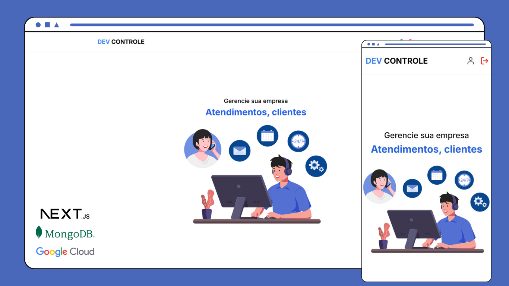
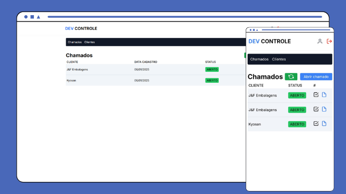
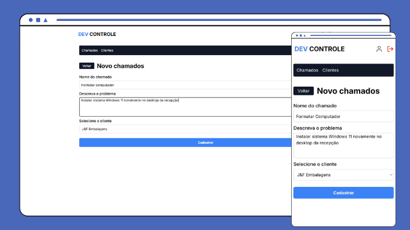
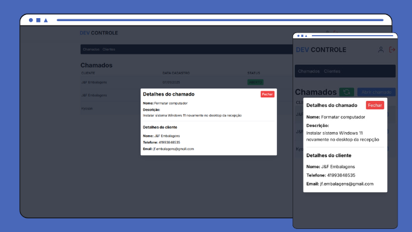
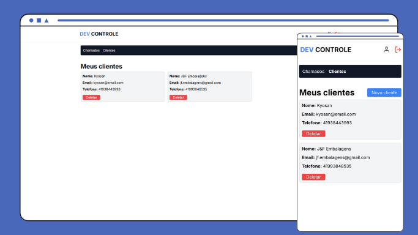
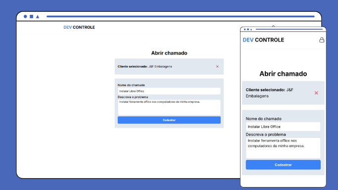

<div style="display: flex; flex-direction: column; text-align: center;">
    <h1>DevControle - Sistema de chamados</h1>
    
</div>

## Sumário

- [\[DevControle\]](#)
  - [Sumário](#sumário)
  - [Introdução](#introdução)
  - [Tecnologias Usadas](#tecnologias-usadas)
  - [Snapshots](#snapshots)
  - [Ambiente de desenvolvimento](#ambiente-de-desenvolvimento)
  - [Informações Técnicas](#informações-técnicas)
  - [Como Executar o Projeto](#como-executar-o-projeto)
  - [Contato](#contato)

## Introdução

Este projeto é um sistema de chamados, com objetivo de organizar solicitações ou tarefas de uma empresa. A aplicação utiliza Next.js 14 com App Router, com recursos de renderização SSR e CSR, para garantir uma otimização na lado do cliente e servidor. O sistema também conta com autenticação via conta Google atráves do NextAuth e o gerenciamento dos dados é feito com o MongoDB, utilizando Prisma como ORM.

## Tecnologias Usadas

&nbsp;
&nbsp;

## Ambiente de desenvolvimento

- Virtual Studio Code - Version 1.96.2
- GitHub Desktop - Version 3.4.12 
- Node.js - Version 22.11.0
- MongoDB Atlas
- Google Cloud

## Informações técnicas

- Utilizado Next 14 com App Router;
- Utilizado TypeScript;
- Armazenamentos dos dados no MongoDB integrado com Prisma ORM;
- Validação dos formulários com Zod;
- Requisições feitas com Axios;
- Utilizado regras e padrões do Prettier;

## Snapshots

### Home


### Chamados



### Cadastro de chamados



### Visualizando chamados



### Clientes cadastrados



### Cliente abrindo chamados sem login



## Como Executar o Projeto

Para executar o projeto siga as instruções:

1. Clone o repositório:

```bash
git clone https://github.com/LucasDoGit/devcontrole
cd devcontrole
```

2. Instale as dependências:

```bash
npm install
```

3. Crie o arquivo *.env* na raiz do projeto e configure as variáveis de ambiente, conforme abaixo.

```javascript
HOST_URL=/* "http://localhost:3000" ou a URL do seu site*/
NODE_ENV=/* "development" para desenvolvimento ou "production" para produção*/

NEXTAUTH_URL=/* "http://localhost:3000" ou a URL do seu site*/
NEXTAUTH_SECRET=/*crie um chave aleatória*/

DATABASE_URL=/*url de acesso ao seu MongoDB*/
/* exemplo (não deixe os espaços) */
DATABASE_URL="mongodb+srv://lucastimoteo: ${senha_de_acesso} @devcontrole.llv6c.mongodb.net/ ${collection} ?retryWrites=true&w=majority&appName= ${appname} "


AUTH_GOOGLE_ID=/* id do seu projeto no google cloud */
AUTH_GOOGLE_SECRET=/* chave secreta do seu projeto */
```

4. Crie os schemas no MongoDB usando o comando.

```bash
npx prisma generate
```

5. use o comando abaixo para iniciar o projeto e aguarde.

```bash
npm run dev
```

6. Feito! O projeto deve ser iniciado e pode ser acesso usando um navegador pela url "http://localhost:3000"

## Contato

Para obter mais informações, entre em contato comigo em:

- Email: filipesantana859@gmail.com
- GitHub: https://github.com/filipe-santana-da-silva/